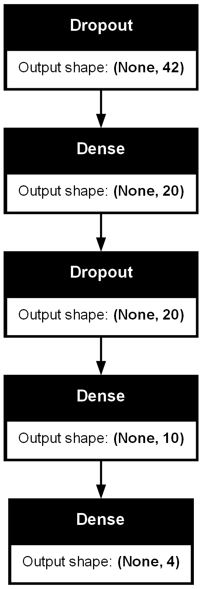
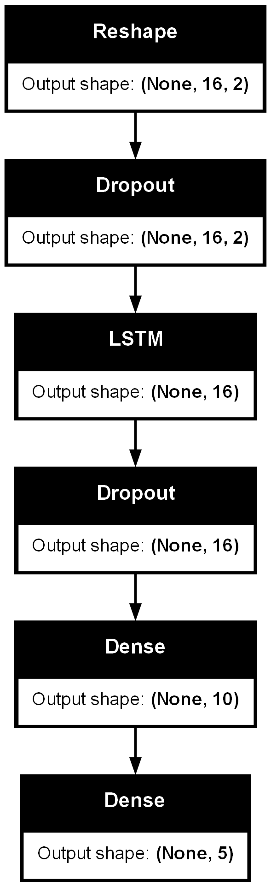

# Recognizes-hand-gestures-and-hand-postures-used-as-video-game-controller
This is a heavily modifified version of https://github.com/Kazuhito00/hand-gesture-recognition-using-mediapipe.
This including:
* Different dataset.
* Different hand gestures.
* Different hand postures.
* Modified mainly for using as an UI controller for videogames.

# How To Run
Run this using your webcam
`python app.py`

# Directory
<pre>
│  app.py
│  keypoint_classification.ipynb
│  point_history_classification.ipynb
│  
├─model
│  ├─keypoint_classifier
│  │  │  keypoint.csv
│  │  │  keypoint_classifier.hdf5
│  │  │  keypoint_classifier.py
│  │  │  keypoint_classifier.tflite
│  │  └─ keypoint_classifier_label.csv
│  │          
│  └─point_history_classifier
│      │  point_history.csv
│      │  point_history_classifier.hdf5
│      │  point_history_classifier.py
│      │  point_history_classifier.tflite
│      └─ point_history_classifier_label.csv
│          
└─utils
    └─cvfpscalc.py
</pre>

# Model Structure
## Hand Posture Model Structure

## Hand Gesture Model Structure

# Model Training Results
## Hand Posture Model Training Results
### Confusion Matrix

### Training History

## Hand Gesture Model Training Results
### Confusion Matrix

### Training History
