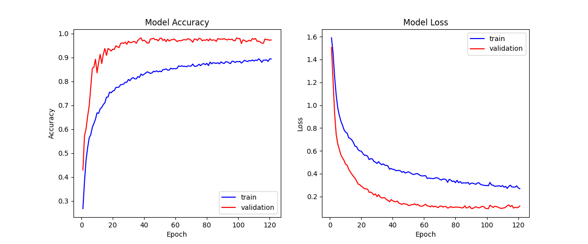
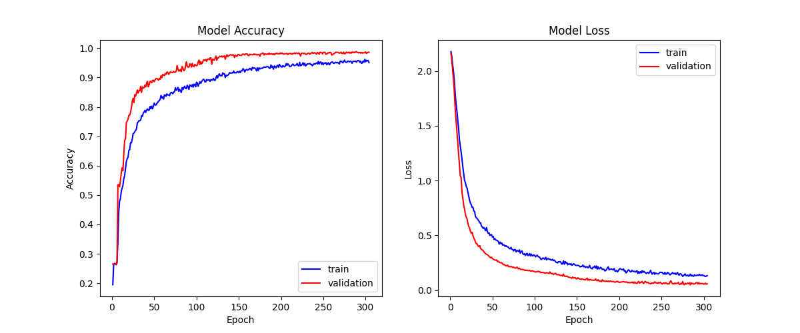

# Recognizes-hand-gestures-and-hand-postures-used-as-video-game-controller
This is a heavily modifified version of https://github.com/Kazuhito00/hand-gesture-recognition-using-mediapipe.
This including:
* Different dataset.
* Different hand postures.
* Different index finger gestures.
* Add hand gestures (included training dataset and training model).
* Add thumb and index finger gestures (included training dataset and training model).
* Modified mainly for using as an *UI controller for videogames*.

# **How To Run**
How to run recording data and testing app.
```bash
python app.py
```
How to run video game controller app.
```bash
python controller.py
``` 

# **Directory**
<pre>
│  app.py
|  controller_labels.csv
│  hand_gesture_classification.ipynb
│  keypoint_classification.ipynb
│  point_history_classification.ipynb
|  thumb_and_index_finger_classification.ipynb
|  
├─model
│  ├─hand_gesture_classifier
│  │  │  hand_gesture.csv
│  │  │  hand_gesture_classifier.keras
│  │  │  hand_gesture_classifier.py
│  │  │  hand_gesture_classifier.tflite
│  │  └─ hand_gesture_classifier_label.csv
│  │
│  ├─keypoint_classifier
│  │  │  keypoint.csv
│  │  │  keypoint_classifier.keras
│  │  │  keypoint_classifier.py
│  │  │  keypoint_classifier.tflite
│  │  └─ keypoint_classifier_label.csv
│  │          
│  └─point_history_classifier
│  │   │  point_history.csv
│  │   │  point_history_classifier.keras
│  |   │  point_history_classifier.py
│  |   │  point_history_classifier.tflite
│  |   └─ point_history_classifier_label.csv
│  │          
│  └─thumb_and_index_finger_classifier
│      │  thumb_and_index_finger.csv
│      │  thumb_and_index_finger_classifier.keras
│      │  thumb_and_index_finger_classifier.py
│      │  thumb_and_index_finger_classifier.tflite
│      └─ thumb_and_index_finger_classifier_label.csv        
└─utils
    └─cvfpscalc.py
</pre>

## app.py
This is a sample program for inference.
In addition, this can also be use to collect:
* Key points data for hand sign recognition.
* Index finger coordinate history data for index finger gesture recognition.
* Landmarks history data for hand gesture recognition.

## hand_gesture_classification.ipynb
This is a model training script for hand gesture recognition.

## keypoint_classification.ipynb
This is a model training script for hand posture recognition.

## point_history_classification.ipynb
This is a model training script for index finger gesture recognition.

## thumb_and_index_finger_classification.ipynb
This is a model training script for thumb and index finger gesture recognition.

## controller_labels.csv
This is the label data for video game controller.

## model/hand_gesture_classifier
This directory stores files related to hand gesture recognition.
The following files are stored:
* Training data (hand_gesture.csv)
* Trained model (hand_gesture_classifier.tflite)
* Label data (hand_gesture_classifier_label.csv)
* Inference module (hand_gesture_classifier.py)

## model/keypoint_classifier
This directory stores files related to hand posture recognition.
The following files are stored:
* Training data (keypoint.csv)
* Trained model (keypoint_classifier.tflite)
* Label data (keypoint_classifier_label.csv)
* Inference module (keypoint_classifier.py)

## model/point_history_classifier
This directory stores files related to index finger gesture recognition.
The following files are stored:
* Training data (point_history.csv)
* Trained model (point_history_classifier.tflite)
* Label data (point_history_classifier_label.csv)
* Inference module (point_history_classifier.py)

## model/thumb_and_index_finger_classifier
This directory stores files related to thumb and index finger gesture recognition.
The following files are stored:
* Training data (thumb_and_index_finger.csv)
* Trained model (thumb_and_index_finger_classifier.tflite)
* Label data (thumb_and_index_finger_classifier_label.csv)
* Inference module (thumb_and_index_finger_classifier.py)

## utils/cvfpscalc.py
This is a module for FPS measurement.

# **Recognition Model**

## *Hand Posture Recognition Model*
### Training
1. Learning data collection
Press "k" to enter Key Points Saving mode (displayed as [Mode:Logging Key Point])
Press "0" to "9" to add the currently displaying keypoints to "model/keypoint_classifier/keypoint.csv" with corresponding label to the number key pressed.
2. Model training
Open "keypoint_classification.ipynb" in Jupyter Notebook and execute from top to bottom.
Change the value of "NUM_CLASSES" corresponding to the number of training data classes and modify the label of "model/keypoint_classifier/keypoint_classifier_label.csv" as appropriate.
### Model Structure

### Pretrained Data Labels
| Index | Labels |
| :---: | :---: |
| `0` | Open |
| `1` | Back |
| `2` | Pointer |
| `3` | Pinch |
| `4` | ThumbOut |
### Evaluation
#### Confusion Matrix

#### Training History


## *Index Finger Gesture Recognition Model*
### Training
1. Learning data collection
Press "h" to enter Index Finger Coordinate Saving mode (displayed as [Mode:Logging Point History])
Press "0" to "9" to add the coordinate of the index finger from the 16 most recent frames to "model/point_history_classifier/point_history.csv" with corresponding label to the number key pressed.
2. Model training
Open "point_history_classification.ipynb" in Jupyter Notebook and execute from top to bottom.
Change the value of "NUM_CLASSES" corresponding to the number of training data classes and modify the label of "model/point_history_classifier/point_history_classifier_label.csv" as appropriate.
### Model Structure

### Pretrained Data Labels
| Index | Labels |
| :---: | :---: |
| `0` | Stop |
| `1` | Up |
| `2` | Down |
| `3` | Left |
| `4` | Right |
### Evaluation
#### Confusion Matrix

#### Training History


## *Hand Gesture Recognition Model*
### Training
1. Learning data collection
Press "j" to enter Hand Landmark Saving mode (displayed as [Mode:Logging Hand Gesture])
Press "0" to "9" to add the hand landmark from the 16 most recent frames to "model/hand_gesture_classifier/hand_gesture.csv" with corresponding label to the number key pressed.
2. Model training
Open "hand_gesture_classification.ipynb" in Jupyter Notebook and execute from top to bottom.
Change the value of "NUM_CLASSES" corresponding to the number of training data classes and modify the label of "model/hand_gesture_classifier/hand_gesture_classifier_label.csv" as appropriate.
### Model Structure

### Pretrained Data Labels
| Index | Labels |
| :---: | :---: |
| `0` | Stop |
| `1` | PointerMove |
| `2` | Select |
| `3` | SwipeUp |
| `4` | SwipeDown |
| `5` | SwipeLeft |
| `6` | SwipeRight |
| `7` | SlideLeft |
| `8` | SlideRight |
### Evaluation
#### Confusion Matrix

#### Training History


## *Thumb And Index Finger Gesture Recognition Model*
### Training
1. Learning data collection
Press "l" to enter Thumb And Index Finger Saving mode (displayed as [Mode:Logging Thumb And Index Finger Gesture])
Press "0" to "9" to add the thumb and index finger coordinate from the 16 most recent frames to "model/thumb_and_index_finger_classifier/thumb_and_index_finger.csv" with corresponding label to the number key pressed.
2. Model training
Open "thumb_and_index_finger_classification.ipynb" in Jupyter Notebook and execute from top to bottom.
Change the value of "NUM_CLASSES" corresponding to the number of training data classes and modify the label of "model/thumb_and_index_finger_classifier/thumb_and_index_finger_classifier_label.csv" as appropriate.
### Model Structure

### Pretrained Data Labels
| Index | Labels |
| :---: | :---: |
| `0` | Stop |
| `1` | PointerMove |
| `2` | Select |
| `3` | SwipeUp |
| `4` | SwipeDown |
| `5` | SwipeLeft |
| `6` | SwipeRight |
| `7` | SlideLeft |
| `8` | SlideRight |
### Evaluation
#### Confusion Matrix

#### Training History



# **Data Labels**
## Thumb And Index Finger Gesture Labels


# **Model Structure**
## Index Finger Gesture Structure


## Hand Gesture Model Structure


## Thumb And Index Finger Gesture Model Structure


# **Video Game Controller**
This app uses the combination of hand posture and index finger gestures to output corresponding control commands for the game.
The corresponding control command is given in the following table:
|  | `Open` | `Back` | `Pointer` | `Pinch` | `ThumbOut` |
| :---: | :---: | :---: | :---: | :---: | :---: |
| `Stop` | Wait | Return | Mouse | Wait | Click |
| `Up` | SwipeUp | Return | Mouse | SlideUp | Click |
| `Down` | SwipeDown | Return | Mouse | SlideDown | Click |
| `Left` | SwipeLeft | Return | Mouse | SlideLeft | Click |
| `Right` | SwipeRight | Return | Mouse | SlideRight | Click |