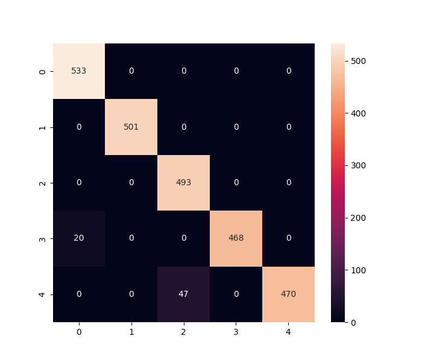
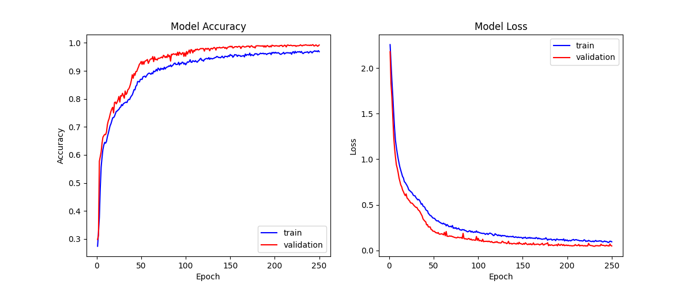

# Recognizes-hand-gestures-and-hand-postures-used-as-video-game-controller
This is a heavily modifified version of https://github.com/Kazuhito00/hand-gesture-recognition-using-mediapipe.
This including:
* Different dataset.
* Different hand postures.
* Different index finger gestures.
* Add hand gestures.
* Modified mainly for using as an UI controller for videogames.

# *How To Run*
Here's how to run this using your webcam.
```bash
python app.py
```

# *Directory*
<pre>
│  app.py
│  hand_gesture_classification.ipynb
│  keypoint_classification.ipynb
│  point_history_classification.ipynb
│  
├─model
│  ├─hand_gesture_classifier
│  │  │  hand_gesture.csv
│  │  │  hand_gesture_classifier.keras
│  │  │  hand_gesture_classifier.py
│  │  │  hand_gesture_classifier.tflite
│  │  └─ hand_gesture_classifier_label.csv
│  │
│  ├─keypoint_classifier
│  │  │  keypoint.csv
│  │  │  keypoint_classifier.keras
│  │  │  keypoint_classifier.py
│  │  │  keypoint_classifier.tflite
│  │  └─ keypoint_classifier_label.csv
│  │          
│  └─point_history_classifier
│      │  point_history.csv
│      │  point_history_classifier.keras
│      │  point_history_classifier.py
│      │  point_history_classifier.tflite
│      └─ point_history_classifier_label.csv
│          
└─utils
    └─cvfpscalc.py
</pre>
## app.py
This is a sample program for inference.
In addition, this can also be use to collect:
* Key points data for hand sign recognition.
* Index finger coordinate history data for index finger gesture recognition.
* Landmarks history data for hand gesture recognition.

## hand_gesture_classification.ipynb
This is a model training script for hand gesture recognition.

## keypoint_classification.ipynb
This is a model training script for hand posture recognition.

## point_history_classification.ipynb
This is a model training script for index finger gesture recognition.

## model/hand_gesture_classifier
This directory stores files related to hand gesture recognition.
The following files are stored:
* Training data (hand_gesture.csv)
* Trained model (hand_gesture_classifier.tflite)
* Label data (hand_gesture_classifier_label.csv)
* Inference module (hand_gesture_classifier.py)

## model/keypoint_classifier
This directory stores files related to hand posture recognition.
The following files are stored:
* Training data (keypoint.csv)
* Trained model (keypoint_classifier.tflite)
* Label data (keypoint_classifier_label.csv)
* Inference module (keypoint_classifier.py)

## model/point_history_classifier
This directory stores files related to index finger gesture recognition.
The following files are stored:
* Training data (point_history.csv)
* Trained model (point_history_classifier.tflite)
* Label data (point_history_classifier_label.csv)
* Inference module (point_history_classifier.py)

## utils/cvfpscalc.py
This is a module for FPS measurement.

# *Data Labels*
## Hand Posture Labels
| Index | Labels |
| :---: | :---: |
| `0` | Swipe |
| `1` | Hold |
| `2` | Pointer |
| `3` | HoldFingerTip |
## Index Finger Gesture Labels
| Index | Labels |
| :---: | :---: |
| `0` | Stop |
| `1` | SwipeUp |
| `2` | SwipeDown |
| `3` | SwipeLeft |
| `4` | SwipeRight |
## Hand Gesture Labels
| Index | Labels |
| :---: | :---: |
| `0` | Stop |
| `1` | Select |
| `2` | SwipeUp |
| `3` | SwipeDown |
| `4` | SwipeLeft |
| `5` | SwipeRight |
| `6` | SlideLeft |
| `7` | SlideRight |

# *Model Structure*
## Hand Posture Model Structure

## Index Finger Gesture Structure

## Hand Gesture Model Structure


# Model Training Results
## Hand Posture Model Training Results
### Confusion Matrix

### Training History


## Index Finger Gesture Model Training Results
### Confusion Matrix

### Training History


## Hand Gesture Model Training Results
### Confusion Matrix

### Training History
